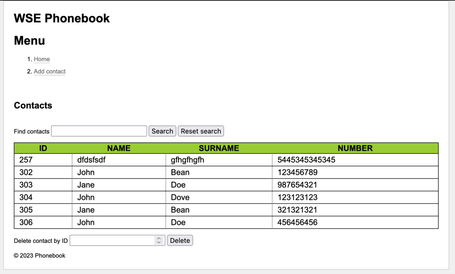
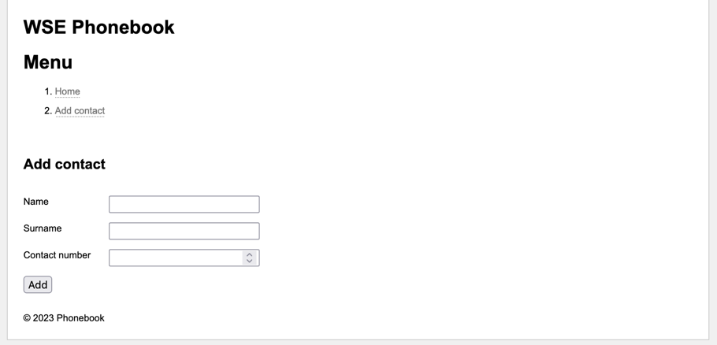
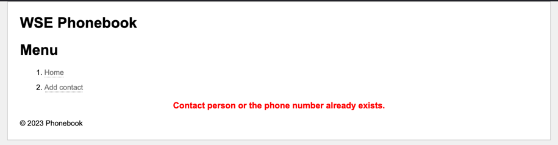

# WSE Phonebook Project

## Author
Łukasz Tarasiewicz, WSE, informatyka stosowana, 3 rok

Numer albumu: K12618

## Technologies
1. Java EE Servlet API
2. JPA, Hibernate
3. ThymeLeaf
4. HSQLDB
5. Language: Java 17

## Pages

### Homepage

Features:
- Search contacts by any property
- Reset search to go back to the full list
- Delete contact record by ID

### Add Contact Page

Features:
- Create a new contact record
- Validate input length on the client-side
- Validate contact record uniqueness on the server-side
- Display error messages on the dedicated page in case of validation failure

### Failed Validation Page

Features:
- Display error messages about failed validation
- Error messages are read from the session object and displayed on the page
